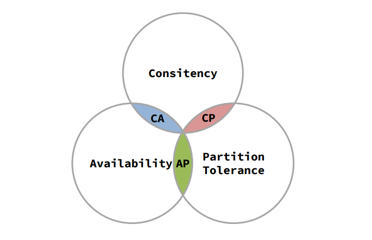
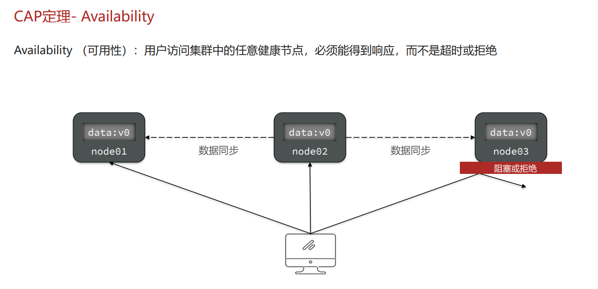
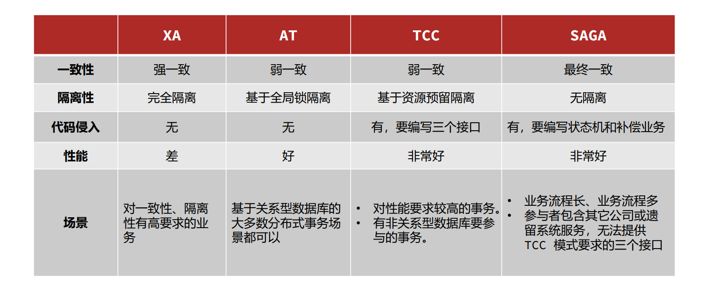

# ❀每日进阶


  

## Day1️⃣CAS定理

1998年，加州大学的计算机科学家 Eric Brewer 提出，分布式系统有三个指标： 

- **Consistency（一致性）**

- **Availability（可用性）**

- **Partition tolerance （分区容错性）**

Eric Brewer 说，分布式系统无法同时满足这三个指标。 这个结论就叫做 CAP 定理。




**Consistency（一致性）**


**Availability（可用性）**




**Partition tolerance （分区容错性）**


简述CAP定理内容？ 

- **分布式系统节点通过网络连接，一定会出现分区问题（P）**
- 当分区出现时，系统的一致性（**C**）和可用性（**A**）就无法 同时满足 


思考：elasticsearch集群是CP还是AP？ 

- ES集群出现分区时，故障节点会被剔除集群，数据分片会 重新分配到其它节点，保证数据一致。
- 因此是低可用性，高一致性，属于CP


---


## Day1️⃣Base理论

BASE理论是对CAP的一种解决思路，包含三个思想： 

- BA[**基本可用**]：分布式系统在出现故障时，允许损失部分可用性，即保证核心可用。
- S [**软状态**]：在一定时间内，允许出现中间状态，比如临时的不一致状态。
- E [**最终一致性**]：虽然无法保证强一致性，但是在软状态结束后，最终达到数据一致。 


|          词           |     意     |
| :-------------------: | :--------: |
|  Basically Available  |  基本可用  |
|      Soft State       |   软状态   |
| Eventually Consistent | 最终一致性 |


而分布式事务最大的问题是各个子事务的一致性问题，因此可以借鉴CAP定理和BASE理论：

- **AP模式：**各子事务分别执行和提交，允许出现结果不一致，然后采用弥补措施恢复数据即可，**实现最终一致**。
- **CP模式：**各个子事务执行后互相等待，同时提交，同时回滚，达成**强一致**。但事务等待过程中，处于**弱可用状态**。


解决分布式事务，各个子系统之间必须能感知到彼此的事务状态，才能保证状态一致，

因此需要一个事务协调者来协调每一个事务的参与者（子系统事务）。

这里的子系统事务，称为**分支事务**；有关联的各个分支事务在一起称为**全局事务**

4️⃣5️⃣6️⃣7️⃣

---


## Day1️⃣Seata


Seata是2019年1月份蚂蚁金服和阿里巴巴共同开源的分布式事务解决方案。致力于提供高性能和简单易用的分布式 事务服务，为用户打造一站式的分布式解决方案。 

官网地址：http://seata.io/，其中的文档、播客中提供了大量的使用说明、源码分析。


🔖Seata架构

Seata事务管理中有三个重要的角色：

- **TC - 事务协调者**：维护全局和分支事务的状态，协调全局事务提交或回滚。
- **TM - 事务管理器**：定义全局事务的范围、开始全局事务、提交或回滚全局事务。
- **RM - 资源管理器**：管理分支事务处理的资源，与TC交谈以注册分支事务和报告分支事务 的状态，并驱动分支事务提交或回滚


|           词            |   简   |       意       |
| :---------------------: | :----: | :------------: |
| Transaction Coordinator | **TC** | **事务协调者** |
|   Transaction Manager   | **TM** | **事务管理器** |
|    Resource Manager     | **RM** | **资源管理器** |


### 1️⃣XA模式

**XA模式原理**

`XA规范`是 X/Open 组织定义的分布式事务处理（DTP，Distributed Transaction Processing）标准，`XA规范`描述了全局的 `TM`与局部的`RM`之间的接口，几乎所有主流的数据库都对`XA规范`提供了支持。

XA模式的优点

- 事务的强一致性，满足ACID原则。
- 常用数据库都支持，实现简单，并且没有代码侵入 

XA模式的缺点

- 因为一阶段需要锁定数据库资源，等待二阶段结束才释放，性能较差
- 依赖关系型数据库实现事务


实现XA模式

1. 修改application.yml文件（每个参与事务的微服务），开启XA模式：

```yaml
seata:
  data-source-proxy-mode: XA # 开启数据源代理的XA模式
```

2. 给发起全局事务的入口方法添加`@GlobalTransactional`注解，本例中是OrderServiceImpl中的create方法：

```java
@Override
@GlobalTransactional
public Long create(Order order) {
	// 创建订单
	orderMapper.insert(order);
	// 扣余额 ...略
	// 扣减库存 ...略
	return order.getId();
}
```


### 2️⃣AT模式

**AT模式原理**

AT模式同样是分阶段提交的事务模型，不过缺弥补了XA模型中资源锁定周期过长的缺陷。

**阶段一RM的工作**：

1. 注册分支事务
2. 记录undo-log（数据快照）
3. 执行业务sql并提交
4. 报告事务状态 

**阶段二提交时RM的工作**：

- 删除undo-log即可 

**阶段二回滚时RM的工作**：

- 根据undo-log恢复数据到更新前

AT模式与XA模式最大的区别

- XA模式一阶段不提交事务，锁定资源；AT模式一阶段直接 提交，不锁定资源。
- XA模式依赖数据库机制实现回滚；AT模式利用数据快照实 现数据回滚
- XA模式强一致；AT模式最终一致


AT模式会**出现脏写问题**

AT解决**解决脏写问题**方式是记录生成修改前后两个快照`before-image`和`after`，乐观锁方式，回滚时候，进行比较


AT模式的优点：

- 一阶段完成直接提交事务，释放数据库资源，性能比较好 

- 利用全局锁实现读写隔离 
- 没有代码侵入，框架自动完成回滚和提交 

AT模式的缺点：

- 两阶段之间属于软状态，属于最终一致
- 框架的快照功能会影响性能，但比XA模式要好很多


### 3️⃣TCC模式

TCC模式与AT模式非常相似，每阶段都是独立事务，不同的是TCC通过人工编码来实现数据恢复。

需要实现三个方法 ：

- Try：资源的检测和预留
- Confirm：完成资源操作业务；要求 Try 成功 Confirm 一定要能成功。
- Cancel：预留资源释放，可以理解为try的反向操作。

TCC的优点

- 一阶段完成直接提交事务，释放数据库资源，性能好
- 相比AT模型，无需生成快照，无需使用全局锁，性能最强
- 不依赖数据库事务，而是依赖补偿操作，可以用于非事务型数据库 

TCC的缺点

- 有代码侵入，需要人为编写try、Confirm和Cancel接口，太麻烦
- 软状态，事务是最终一致
- 需要考虑Confirm和Cancel的失败情况，做好幂等处理
- 业余局限


TCC模式会出现**空回滚**和**业务悬挂**问题

`空回滚`：当某分支事务的try阶段阻塞时，可能导致全局事务超时而触发二阶段的cancel操作。在未执行try操作时先执行了 cancel操作，这时cancel不能做回滚，就是空回滚。

`业务悬挂`：对于已经空回滚的业务，如果以 后继续执行try，就永远不可能 confirm或cancel，这就是业务 悬挂。应当阻止执行空回滚后的 try操作，避免悬挂


### 4️⃣SAGA模式

Saga 模式是 Seata 即将开源的长事务解决方案，将由蚂蚁金服主要贡献。

其理论基础是 `Hector` & `Kenneth`在1987年发表的论文[Sagas](https://microservices.io/patterns/data/saga.html)。

Seata官网对于Saga的指南：https://seata.io/zh-cn/docs/user/saga.html

**原理**

在`Saga模式`下，分布式事务内有多个参与者，每一个参与者都是一个冲正补偿服务，需要用户根据业务场景实现其正向操作和逆向回滚操作。

分布式事务执行过程中，依次执行各参与者的正向操作，如果所有正向操作均执行成功，那么分布式事务提交。如果任何一个正向操作执行失败，那么分布式事务会去退回去执行前面各参与者的逆向回滚操作，回滚已提交的参与者，使分布式事务回到初始状态。


Saga模式是SEATA提供的长事务解决方案。也分为两个阶段：

- 一阶段：直接提交本地事务
- 二阶段：成功则什么都不做；失败则通过编写补偿业务来回滚


Saga模式优点：

- 事务参与者可以基于事件驱动实现异步调用，吞吐高
- 一阶段直接提交事务，无锁，性能好
- 不用编写TCC中的三个阶段，实现简单 

Saga模式缺点：

- 软状态持续时间不确定，时效性差
- 没有锁，没有事务隔离，会有脏写


### 🆚四种模式对比




